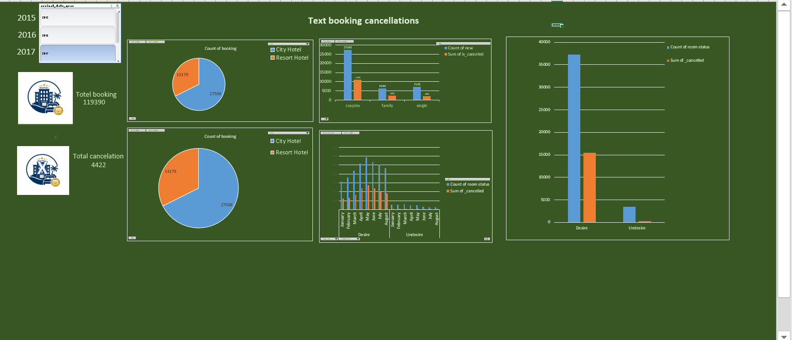

# 🏨 Hotel Booking & Cancellation Analysis (Excel Dashboard)

## 📌 Project Overview

This project presents an interactive **Hotel Booking & Cancellation Analysis Dashboard** built entirely in **Microsoft Excel**. The dashboard analyzes hotel booking data to identify cancellation trends, booking patterns, customer behavior, and the key factors contributing to booking cancellations.

The project uses **Excel Pivot Tables, Pivot Charts, Slicers, and KPIs** to transform raw booking data into meaningful business insights, helping hotel management make informed decisions to reduce cancellations and improve overall performance.

---

## 🎯 Objectives

- Analyze hotel booking data using Microsoft Excel.
- Calculate the overall booking cancellation rate.
- Identify the major reasons behind booking cancellations.
- Compare cancellation rates between City Hotels and Resort Hotels.
- Analyze booking trends by month and season.
- Study customer behavior based on market segment and customer type.
- Create an interactive dashboard for easy data exploration.
- Provide business recommendations to reduce cancellations.

---

## 📂 Dataset

**Dataset:** `hotel_booking.csv`

The dataset contains hotel booking information, including:

- Hotel Type
- Booking Status
- Lead Time
- Arrival Date
- Adults & Children
- Country
- Market Segment
- Distribution Channel
- Deposit Type
- Customer Type
- Average Daily Rate (ADR)
- Previous Cancellations
- Reservation Status

---

## 🛠️ Tools & Skills Used

- Microsoft Excel
- Pivot Tables
- Pivot Charts
- Slicers
- Dashboard Design
- Data Cleaning
- Conditional Formatting
- Data Analysis
- Business Intelligence (BI)

---

## 📊 Dashboard Features

The interactive dashboard includes:

- Total Bookings KPI
- Total Cancelled Bookings
- Cancellation Rate
- Hotel-wise Booking Analysis
- Monthly Booking Trends
- Lead Time Analysis
- Market Segment Analysis
- Customer Type Analysis
- Deposit Type Analysis
- Country-wise Analysis
- Interactive Filters using Slicers

---

## 📈 Key Insights

- City Hotels have a higher cancellation rate than Resort Hotels.
- Bookings with longer lead times are more likely to be cancelled.
- Online Travel Agencies generate the highest number of cancellations.
- Customers with Non-Refundable deposits show lower cancellation rates.
- Peak travel seasons experience a higher number of bookings as well as cancellations.
- Repeat guests are less likely to cancel compared to first-time customers.

---

## 📷 Dashboard Preview

> Dashboard Screenshot



---

## 📁 Project Structure

```
Hotel_Booking-and-cancellation-Analysis/
│
├── hotel_booking.csv
├── Hotel Booking Dashboard.xlsx
├── pr.PNG
└── README.md
```

---

## 💼 Business Recommendations

- Encourage direct hotel bookings through promotional offers.
- Reduce cancellation risks by monitoring bookings with longer lead times.
- Improve customer engagement through reminder emails before check-in.
- Optimize cancellation policies based on customer booking behavior.
- Offer loyalty benefits to encourage repeat bookings.
- Monitor high-risk market segments to minimize revenue loss.

---

## 🚀 How to Use

1. Download the repository.
2. Open the Excel Dashboard file.
3. Use the slicers to filter the data dynamically.
4. Explore Pivot Charts and KPIs for business insights.

---

## 📊 Dashboard Highlights

✔ Interactive Dashboard

✔ Pivot Tables

✔ Pivot Charts

✔ Dynamic Slicers

✔ Business KPIs

✔ Data Cleaning

✔ Trend Analysis

✔ Hotel Booking Insights

---

## 🎯 Conclusion

This project demonstrates how Microsoft Excel can be used as a powerful Business Intelligence tool for data analysis and dashboard creation. By analyzing hotel booking and cancellation data, the dashboard provides actionable insights that can help hotel management reduce cancellations, improve occupancy rates, and make data-driven business decisions.

---

## 👨‍💻 Author

**Abhishek Pandey**

GitHub: https://github.com/abhishekpandeyy555-commits

---

⭐ If you found this project useful, feel free to star the repository.
